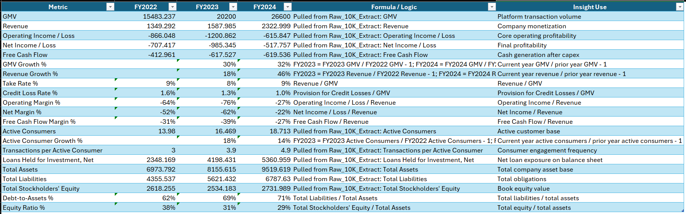
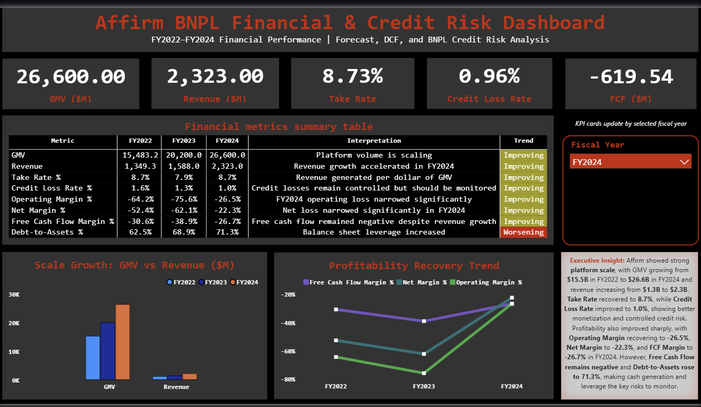
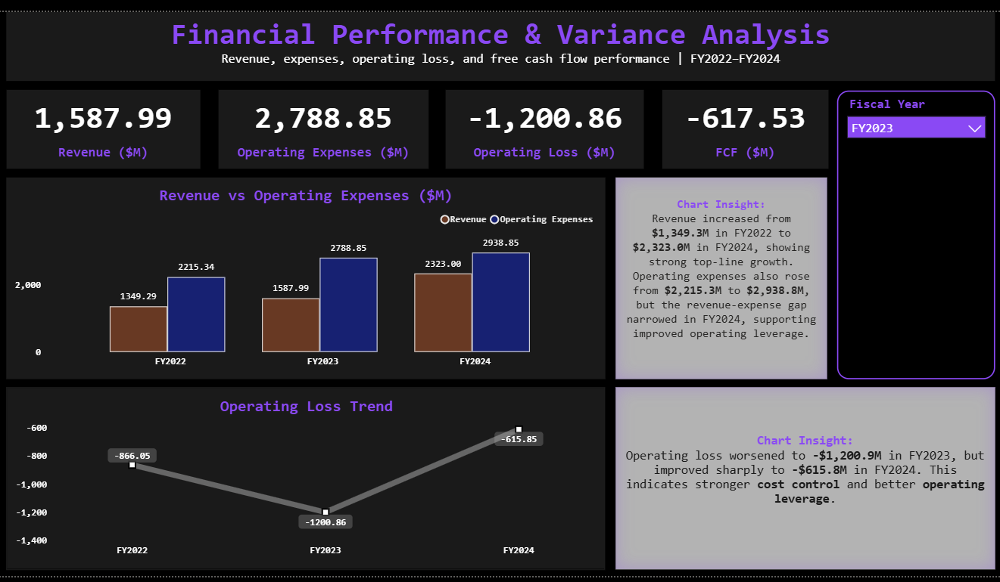
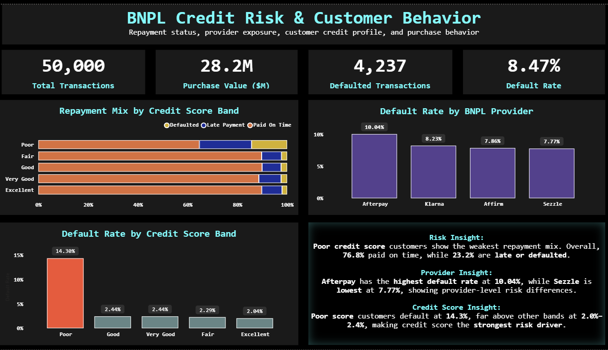
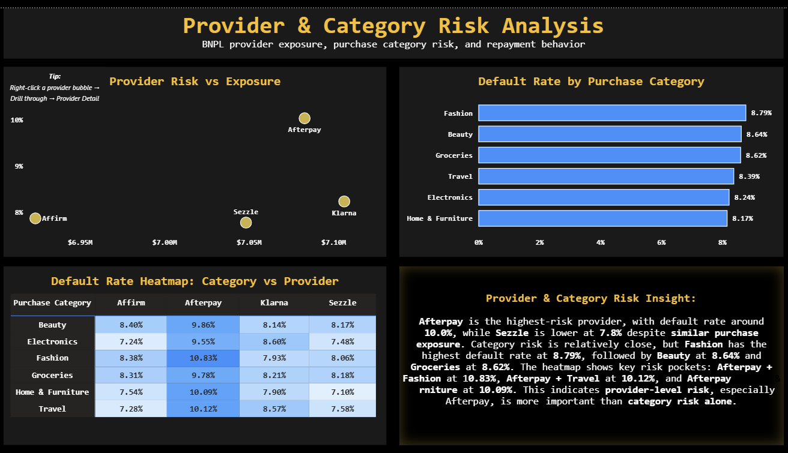
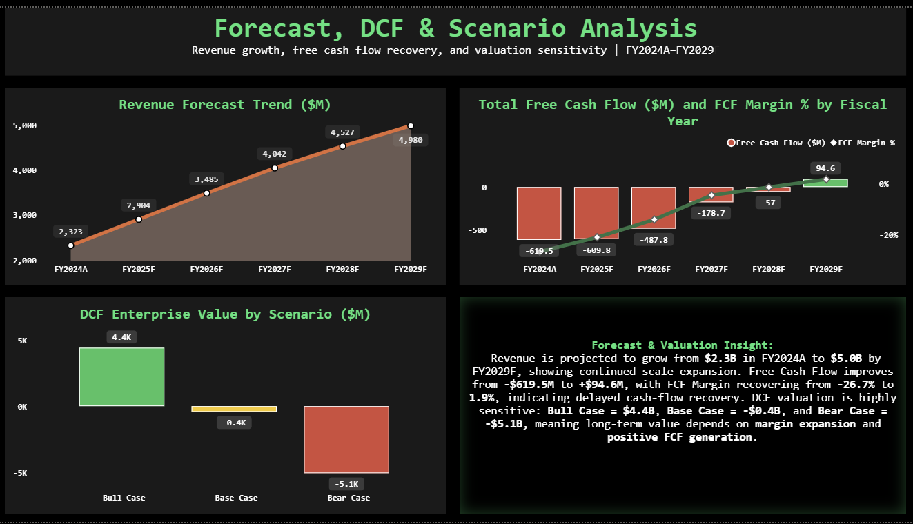
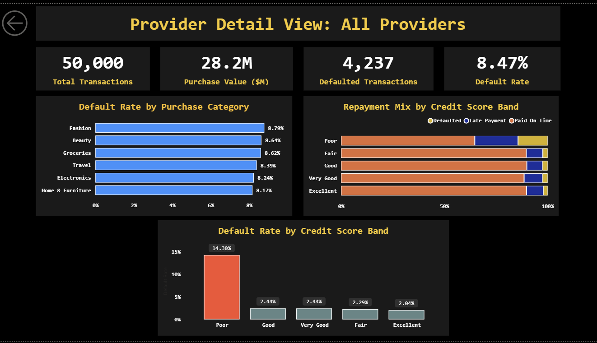

# Affirm BNPL Financial Performance and Credit Risk Dashboard

## Project Overview

This project analyzes Affirm’s BNPL financial performance, credit risk exposure, repayment behavior, provider risk, and forecast-based valuation using Excel and Power BI.

The project combines Affirm FY2022–FY2024 financial filing data with a BNPL transaction dataset. Excel was used for financial modeling, source tracking, and forecast preparation. Power BI was used to build an interactive dashboard with KPIs, risk analysis, scenario analysis, and provider-level drill-through.

## Dashboard Demo


## Business Problem

BNPL companies need to balance growth, profitability, credit risk, and cash-flow recovery. This project evaluates whether Affirm’s growth is supported by improving margins, controlled credit losses, and future free cash flow improvement.

Main business questions:

1. Is Affirm growing GMV and revenue efficiently?
2. Are profitability and free cash flow improving?
3. Which customer segments have the highest default risk?
4. Which BNPL providers and purchase categories show higher repayment risk?
5. How sensitive is enterprise value under different forecast scenarios?

## Tools Used

| Tool        | Purpose                                                                   |
| ----------- | ------------------------------------------------------------------------- |
| Excel       | Financial model, source tracker, KPI tables, forecast and scenario tables |
| Power BI    | Dashboard development, data modeling, DAX, slicers, drill-through         |
| Power Query | Data cleaning and transformation                                          |
| DAX         | KPI measures, default rate, dynamic titles, FCF margin                    |
| GitHub      | Project documentation and portfolio publishing                            |

## Project Workflow

```text
1. Collected Affirm FY2022–FY2024 10-K filings.
2. Extracted key financial, operating, funding, and profitability metrics in Excel.
3. Built a structured Excel financial model with source page references.
4. Cleaned and prepared BNPL transaction-level data.
5. Imported Excel model and cleaned dataset into Power BI.
6. Created DAX measures for KPIs, default rate, FCF margin, and drill-through titles.
7. Built six Power BI dashboard pages.
8. Added slicers, conditional formatting, matrix heatmaps, scenario analysis, and provider drill-through.
9. Documented DAX measures, data dictionary, assumptions, and limitations.
```

## Repository Structure

```text
affirm-bnpl-financial-credit-risk-dashboard/
│
├── data/
│   ├── raw/
│   │   ├── affirm_2022_10k.pdf
│   │   ├── affirm_2023_10k.pdf
│   │   ├── affirm_2024_10k.pdf
│   │   └── bnpl_dataset_v2.csv
│   └── processed/
│       └── bnpl_transactions_clean.csv
│
├── excel/
│   └── affirm_financial_model.xlsx
│
├── powerbi/
│   └── affirm_bnpl_financial_credit_risk_dashboard.pbix
│
├── assets/
│   ├── demo/
│   │   └── affirm_bnpl_dashboard_demo.mp4
│   └── screenshots/
│       ├── 00_excel_financial_model.png
│       ├── 01_executive_summary.png
│       ├── 02_financial_performance.png
│       ├── 03_credit_risk_analysis.png
│       ├── 04_provider_category_risk.png
│       ├── 05_forecast_scenario.png
│       └── 06_provider_detail_drillthrough.png
│
├── docs/
│   ├── dax_measures.md
│   ├── data_dictionary.md
│   └── assumptions_limitations.md
│
├── LICENSE
└── README.md
```

## Data Sources

The project uses two data sources:

1. Affirm FY2022–FY2024 financial filings
   Used to extract company-level metrics such as GMV, revenue, take rate, credit loss rate, operating loss, free cash flow, assets, liabilities, and funding metrics.

2. BNPL transaction dataset
   Used to analyze repayment behavior, default risk, BNPL provider exposure, purchase category risk, credit score bands, and late/default patterns.

Note: Affirm financial metrics are based on company filings. The BNPL transaction dataset is used for customer-level risk analysis and may not represent actual Affirm internal customer records.

## Excel Financial Model

Excel was used as the financial modeling and preparation layer before importing data into Power BI.

Key Excel work:

* Extracted FY2022–FY2024 financial metrics from 10-K filings
* Built source tracker with filing page references
* Created clean financial tables for Power BI
* Prepared operating metrics, income statement, balance sheet, and funding metrics
* Built forecast and DCF scenario tables



## Power BI Dashboard Pages

### 1. Executive Summary

This page summarizes GMV, revenue, take rate, credit loss rate, free cash flow, profitability margins, and leverage metrics.

Key insight: Affirm’s GMV grew from $15.5B in FY2022 to $26.6B in FY2024, while revenue increased to $2.3B. Credit Loss Rate improved to 1.0%, but Free Cash Flow remained negative.



### 2. Financial Performance

This page analyzes revenue growth, operating expenses, operating loss, and free cash flow trends.

Key insight: Revenue increased from $1,349.3M in FY2022 to $2,323.0M in FY2024. Operating loss improved from -$1,200.9M in FY2023 to -$615.8M in FY2024.



### 3. Credit Risk Analysis

This page analyzes repayment status, default rate by credit score band, and provider-level default risk.

Key insight: Poor credit score customers had the highest default rate at 14.3%, while other credit score bands stayed around 2.0%–2.4%.



### 4. Provider and Category Risk

This page compares BNPL provider exposure, purchase category risk, and provider-category risk combinations.

Key insight: Afterpay had the highest provider-level default rate at around 10.0%. Fashion was the highest-risk category at 8.79%. The heatmap showed risk pockets such as Afterpay + Fashion at 10.83%.



### 5. Forecast and Scenario Analysis

This page shows revenue forecast, free cash flow recovery, FCF margin, and DCF enterprise value under Bear, Base, and Bull scenarios.

Key insight: Revenue is projected to grow from $2.3B in FY2024A to $5.0B by FY2029F. Free Cash Flow improves from -$619.5M to +$94.6M, but valuation remains highly sensitive to assumptions.



### 6. Provider Detail Drill-through

This page provides provider-level drill-through analysis for Affirm, Afterpay, Klarna, and Sezzle.

Key insight: For Afterpay, the dashboard showed 12,536 transactions, $7.1M purchase value, 1,258 defaulted transactions, and 10.04% default rate.



## Key DAX Measures

### Total Transactions

```DAX
Total Transactions =
COUNTROWS(fact_bnpl_transactions)
```

### Defaulted Transactions

```DAX
Defaulted Transactions =
CALCULATE(
    COUNTROWS(fact_bnpl_transactions),
    fact_bnpl_transactions[Repayment_Status] = "Defaulted"
)
```

### Default Rate

```DAX
Default Rate =
DIVIDE(
    [Defaulted Transactions],
    [Total Transactions]
)
```

### Dynamic Provider Title

```DAX
Selected Provider Title =
"Provider Detail View: " &
SELECTEDVALUE(
    fact_bnpl_transactions[BNPL_Provider],
    "All Providers"
)
```

### FCF Margin %

```DAX
FCF Margin % =
DIVIDE(
    fact_forecast_dashboard[Free Cash Flow],
    fact_forecast_dashboard[Revenue]
)
```

Full DAX documentation: [docs/dax_measures.md](docs/dax_measures.md)

## Key Business Insights

1. GMV increased from $15.5B to $26.6B between FY2022 and FY2024.
2. Revenue increased to $2.3B in FY2024.
3. Credit Loss Rate improved to 1.0%, showing better credit control.
4. Free Cash Flow remained negative, so cash generation is still a key risk.
5. Poor credit score customers showed the highest default rate at 14.3%.
6. Afterpay showed the highest provider-level default rate at around 10.0%.
7. DCF valuation is highly sensitive to revenue growth, margin expansion, and FCF recovery.

## Business Recommendations

1. Monitor Poor credit score customers with stricter credit risk controls.
2. Track Afterpay separately because it shows higher provider-level default risk.
3. Use provider-category heatmaps to identify early risk pockets.
4. Improve free cash flow conversion because FCF remains negative in the near term.
5. Review forecast and DCF assumptions regularly because valuation is sensitive to cash-flow recovery.

## Documentation

Additional documentation:

* [DAX Measures](docs/dax_measures.md)
* [Data Dictionary](docs/data_dictionary.md)
* [Assumptions and Limitations](docs/assumptions_limitations.md)

## Skills Demonstrated

Excel:

* Financial modeling
* 10-K data extraction
* Source tracking
* Structured financial tables
* Forecast and scenario tables

Power BI:

* Dashboard design
* Data modeling
* Power Query
* DAX measures
* Slicers
* Conditional formatting
* Matrix heatmaps
* Drill-through navigation
* Dynamic titles

Finance and Analytics:

* GMV analysis
* Revenue analysis
* Take Rate analysis
* Credit Loss Rate analysis
* Free Cash Flow analysis
* DCF scenario analysis
* Credit risk segmentation
* Provider and category risk analysis

## Assumptions and Limitations

* Affirm financial metrics are based on FY2022–FY2024 reported financial data.
* BNPL transaction data is used for customer-level repayment and credit risk analysis.
* The BNPL transaction dataset may not represent actual Affirm internal customer-level records.
* Forecast and DCF outputs are analytical model assumptions created for portfolio demonstration.
* This project is for learning and portfolio purposes and is not investment advice.

## Final Summary

This project demonstrates how Excel and Power BI can be used together to build a finance analytics solution covering financial performance, credit risk, provider exposure, customer repayment behavior, forecasting, and valuation scenario analysis.

## 👨‍💻 About the Author
**Balaji Reddy**
